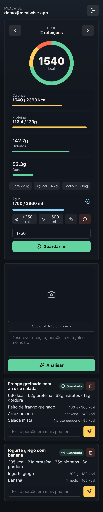

# mealwise

Photo-first calorie and water tracker built as a React PWA with Cloudflare Pages Functions, Supabase, and Gemini.

The app lets signed-in users log meals from photos or text, asks follow-up questions when portions are uncertain, tracks daily calories/macros, and tracks water intake with quick buttons or exact ml entry.

## Screenshots



## Features

- Supabase email/password auth.
- Meal logging by photo, text, or both.
- Gemini nutrition analysis with clarification flow for uncertain meals.
- Saved daily totals for calories, protein, carbs, fat, fiber, sugar, sodium, and water.
- Weight-based targets for calories, protein, and water.
- Private Supabase Storage bucket for meal photos.
- Admin view gated by `ADMIN_EMAILS`.
- PWA manifest and service worker for installable mobile use.

## Tech Stack

- React 19 + Vite
- Cloudflare Pages Functions
- Supabase Auth, PostgREST, Storage, and Row Level Security
- Gemini API
- Vitest

## Local Setup

Install dependencies:

```bash
npm install
```

Copy env template:

```bash
cp .env.example .env
```

Fill only local/public Vite values in `.env`:

```text
VITE_SUPABASE_URL=https://your-project.supabase.co
VITE_SUPABASE_ANON_KEY=your-public-anon-key
```

Run locally:

```bash
npm run dev
```

## Supabase Setup

Create a Supabase project, then run the single setup SQL manually in the Supabase SQL Editor:

```text
supabase/schema.sql
```

Use the same file for fresh projects and older projects. It creates missing objects and applies the text-only meal and water-tracking updates.

The schema enables RLS and creates:

- `profiles`
- `meals`
- `meal_items`
- `clarifications`
- `water_intake`
- private Storage bucket `meal-photos`

## Cloudflare Pages

Build command:

```bash
npm run build
```

Build output:

```text
dist
```

Set these Cloudflare Pages environment variables/secrets:

```text
SUPABASE_URL=https://your-project.supabase.co
SUPABASE_ANON_KEY=your-public-anon-key
SUPABASE_SERVICE_ROLE_KEY=your-service-role-key
GEMINI_API_KEY=your-gemini-api-key
GEMINI_MODEL=gemini-2.5-flash
GEMINI_FALLBACK_MODELS=gemini-2.5-flash,gemini-3.1-flash-lite-preview,gemini-3-flash-preview,gemini-2.5-flash-lite
MOCK_GEMINI=false
ADMIN_EMAILS=admin@example.com
```

`SUPABASE_SERVICE_ROLE_KEY` and `GEMINI_API_KEY` must stay server-side in Cloudflare. Never expose them through Vite env vars.

Local Pages smoke test with mocked AI:

```bash
npm run build
MOCK_GEMINI=true npx wrangler pages dev dist
```

## Security Notes

- Do not commit `.env`, `.dev.vars`, Cloudflare secrets, Supabase service-role keys, or Gemini API keys.
- The browser only receives Supabase URL and anon key.
- Mutating API routes require a valid Supabase user session.
- Admin API requires the signed-in email to be listed in `ADMIN_EMAILS`.
- Meal photos are stored in a private bucket and served through short-lived signed URLs.
- Meal photos and descriptions are sent to Gemini for nutrition analysis.

## Photo storage and quota recovery

New meal photos are resized in the browser to at most 1280 pixels on the longest
side and encoded as JPEG, with a 512 KB ceiling. The API rejects larger files and
unsupported formats. Photos that the browser cannot decode require a JPEG, PNG,
or WebP export. Existing photos remain usable for clarification and revision.

Deleting a meal removes its photo through the Storage API before removing the
meal row. A Storage failure leaves the row available for retry. If the later DB
delete fails, the row can remain without its photo until deletion is retried.
Failed meal inserts clean up uploaded photos only after checking that no committed
meal references them; cleanup failures are logged for a later storage audit.

For existing projects, deploy compression first, then manually run
`supabase/photo-limits.sql` in the Supabase SQL editor to enforce the same ceiling
on direct Storage uploads. Older cached clients may need a refresh. Lowering the
limit does not resize existing files.

The October 2026 restriction email names the **organization** `linktree`; its quota
is shared across projects, including the supplied Mealwise project
`dpcakoopjncincfucflv`. The email reports 1.42 GB against a 1.1 GB Storage quota.
The old code allowed 50 MB photos and retained them after meal deletion. Inspect
actual bucket totals before attributing all organization usage to this app.

Run each query in `supabase/storage-audit.sql` **separately** to see bucket sizes,
largest files, and unused meal photos. Review unused files and remove them using
the Storage dashboard/API. Never DELETE rows from `storage.objects` or
`storage.buckets`: that does not remove physical files. Keep referenced meal
photos unless you have backed them up and explicitly decided to remove them.

Billing Storage usage is averaged across the cycle, so cleaning up current files
may not immediately lift restrictions. The email gives October 21, 2026 as the
quota reset date. A paid upgrade can lift restrictions immediately and requires
the account owner's decision. See [Storage usage](https://supabase.com/docs/guides/platform/manage-your-usage/storage-size)
and [restriction recovery](https://supabase.com/docs/guides/platform/billing-faq).

## Verification

```bash
npm test
npm run build
npx tsc -p tsconfig.functions.json --noEmit
npm audit --audit-level=moderate
```

## License

MIT. See [LICENSE](LICENSE).
